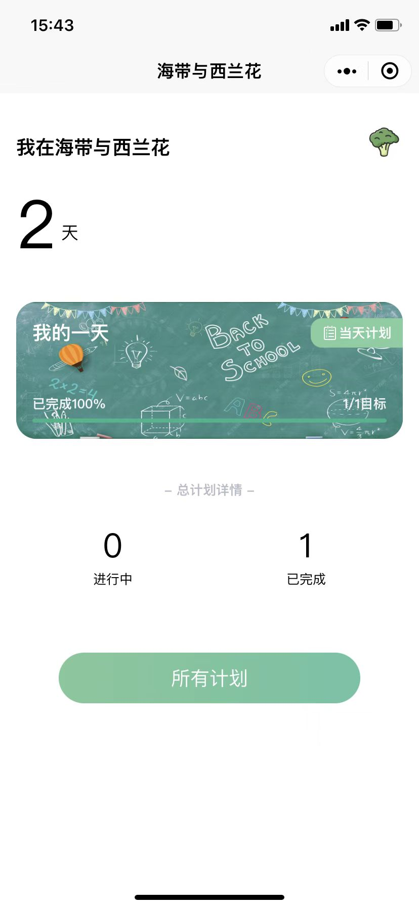

<h1 align="center">Kelp and Broccoli</h1>

注意：该仓库已放弃维护与更新，请到 [Kelp and Broccoli Uni](https://github.com/cleves0315/kelp-and-broccoli-uni) 获取最新帮助。

> 🍭 哇，一款超可爱的 TodoList 小程序

## 介绍

海带与西兰花是一款计划管理工具，他界面简洁而又不失优雅，操作丝滑简单，让你每日的计划管理更加的简单。

## 功能

- 使用原生微信小程序云开发
- 添加计划，输入计划名称
- 方便快速设定截止日期与重复周期
- 支持定时推送消息
- 计划类型分类（”我的一天“ 为当天主要任务）

## 预览

